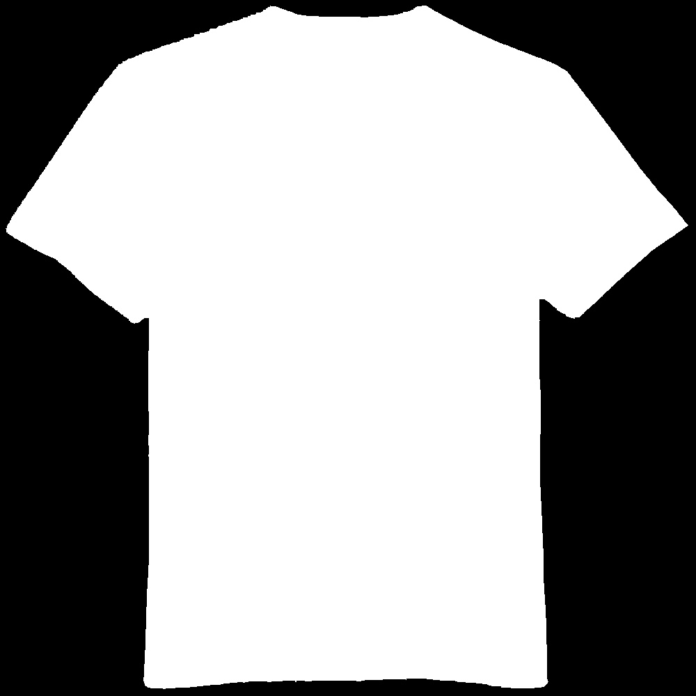
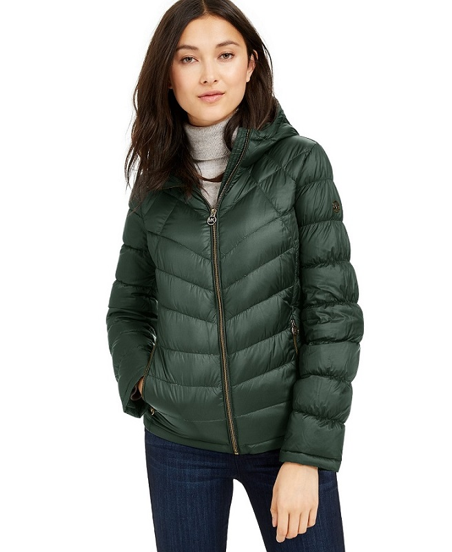
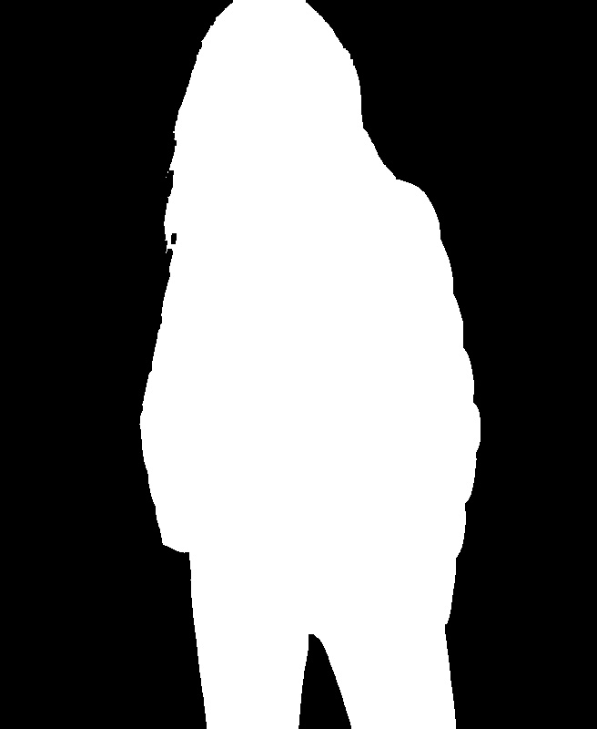

# Solid-Background-Removal
Background removal of an image using OpenCV and Deep Learning.

# Background Removal Example 

                 Original                                                               Result

  
  

  
  

